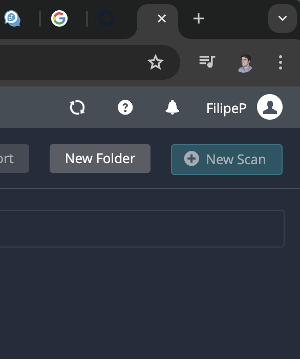
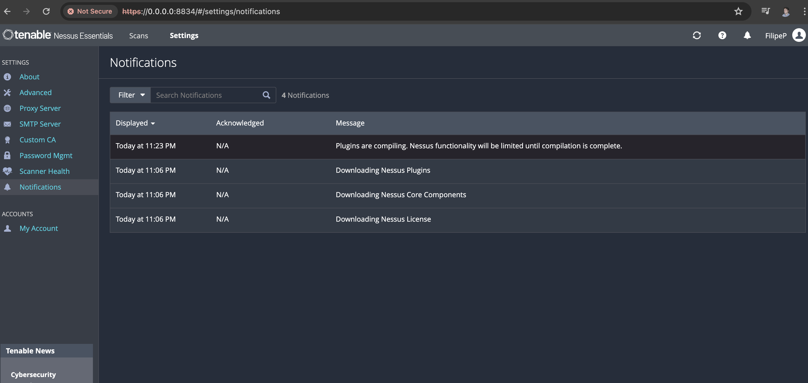
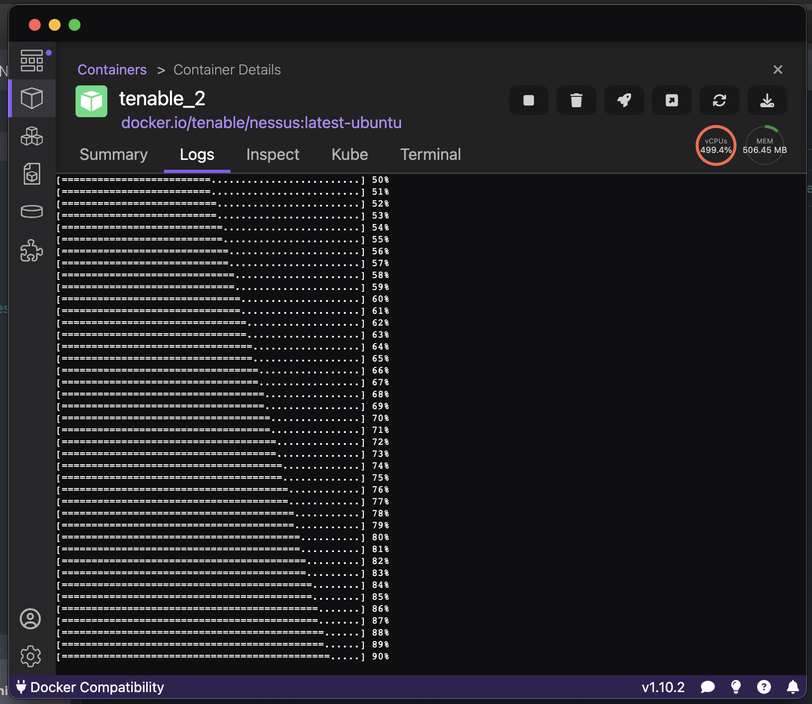
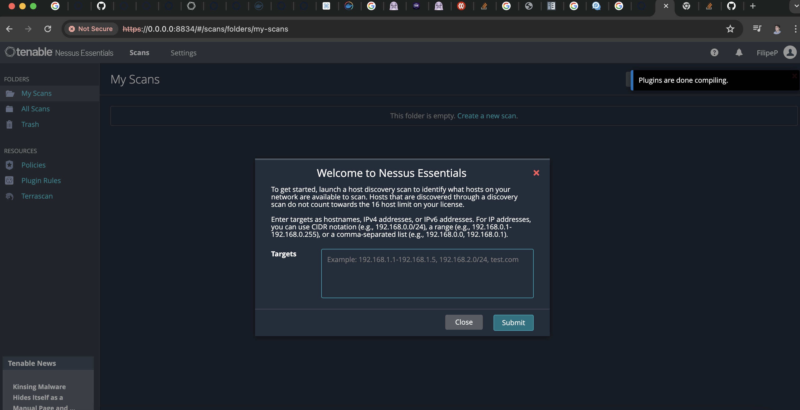

# Tenable / Nessus 101

This repo is to explore Tenable 101. We needed a testing environment so we can run experiemnts and not disrupt ongoing scans of active infrastructure. For this the best we can do is create a local Dev Environment that is easy to setup. 

References: https://www.tenable.com/downloads/nessus?_gl=1*16tobqy*_ga*MTU2MTM4NDcxNi4xNzE2MTk2MzM5*_ga_HSJ1XWV6ND*MTcxNjM4NTk3Mi41LjEuMTcxNjM4NTk3NS41Ny4wLjMxODQwMjQ0Mw


### Pre requisists

- Docker Installed
Or
- Podman Installed

Note: As docker desktop is not longer open source & running a deamon has become convoluted we'll be using `podman`

### Instalation

Follow and choose 

```python 
# run this to pull an image with tennable 
# $ docker pull tenable/nessus:(version-OS) #ubuntu or oracle
#$ docker pull tenable/nessus:latest-ubuntu
# or
#$ docker pull tenable/nessus

$ podman pull docker.io/tenable/nessus:latest-ubuntu

# Set higher limits for podmand (needed)
$ podman machine stop
$ podman machine set --cpus 8 --memory 6144
$ podman machine start

#$ podman run -dt -p 8834:8834 docker.io/tenable/nessus:latest-ubuntu
$ podman run -dt --name tenable_3 -m 5120m --cpuset-cpus 4-12 -p 8834:8834 docker.io/tenable/nessus:latest-ubuntu

# After container exist you can start it from the Podman app or from CLI
$ podman start tenable_3 

# see intance here: 
https://0.0.0.0:8834/#/

# Register for Nessus Essentials to get activation key
https://tenable.com/products/nessus/nessus-essentials

# Use activation key to register and wait for scanner to come online
```

**Note: Nessus will not be ready until it finishes compiling**

**no scan**


**message about lack of functionality**


**podman logs with progress**


**Nessus Ready to run**
